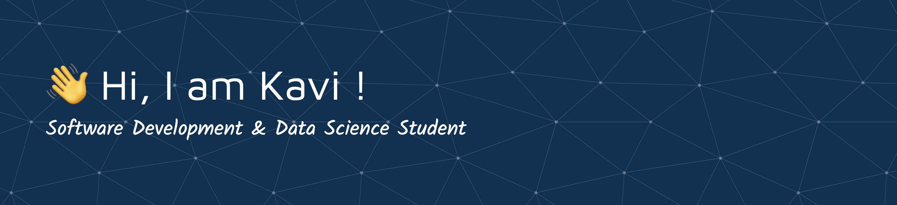

🎓 **[Bachelor of Advanced Computing](https://www.sydney.edu.au/courses/courses/uc/bachelor-of-advanced-computing.html)** @ **University of Sydney**  
💡 **Majors:** Computational Data Science & Software Development  
🚀 **Passionate about:** AI, Machine Learning, Cybersecurity & Software Dev  
🔍 **Always exploring:** Cutting-edge tech, automation, and AI-driven solutions  

# 💻 Skills:
                            
## 🌐 Socials:
  

# 📊 GitHub Stats:
 
 

---

<!-- Proudly created with GPRM ( https://gprm.itsvg.in ) -->
